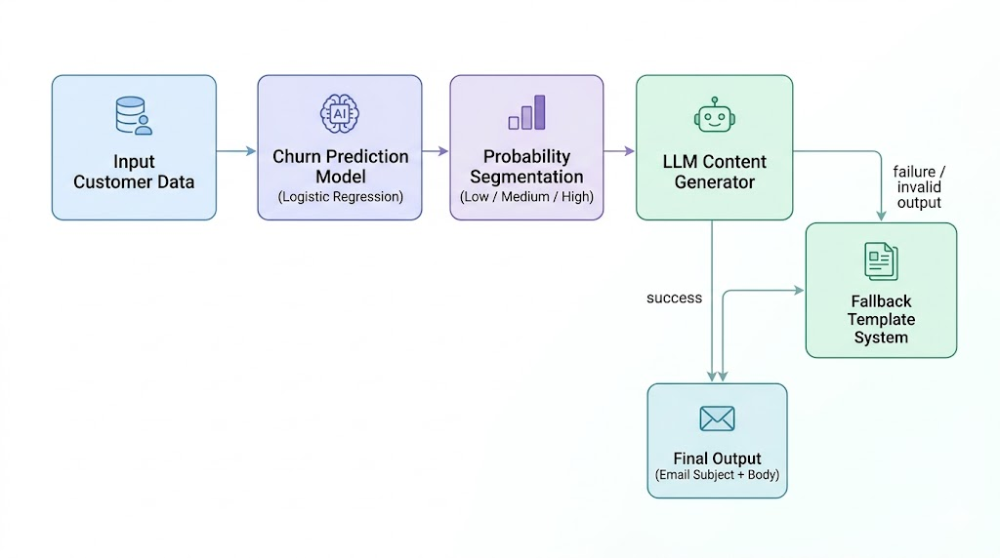
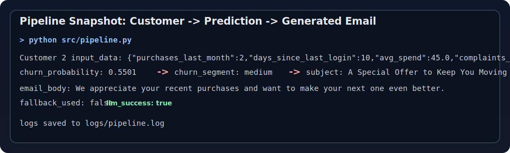
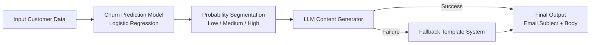

# RetentionFlow-AI

An end-to-end AI system for churn prediction and personalized customer retention in e-commerce.


## Overview
RetentionFlow-AI addresses a core e-commerce challenge: customer churn.
Acquiring new users is expensive, while retaining existing customers typically drives stronger long-term unit economics.
This project combines predictive AI and generative AI in one practical workflow.
It first estimates churn risk using a classification model, then generates personalized retention content aligned to that risk.
The result is an actionable system that turns model output into business communication, not just a dashboard score.

## 🚀 Highlights
- End-to-end AI pipeline combining prediction and generation
- Probability-based churn segmentation (low/medium/high)
- Structured LLM outputs with reliability constraints
- Fallback system for production robustness
- Modular design for future scalability (RAG, real-time systems)
- Designed with separation of concerns (data, model, generation, orchestration)

## ⚡ Quick Demo
```bash
python src/pipeline.py
```

### Pipeline Output Snapshot


Example Output:
- churn_probability: 0.78
- churn_segment: high
- subject: We Miss You - Here’s 15% Off Your Next Order

## Key Features
- Churn prediction using Logistic Regression
- Probability-based segmentation (low/medium/high)
- LLM-powered personalized marketing messages
- Structured outputs (subject + email_body)
- Fallback system for reliability
- End-to-end pipeline with logging

## Why This Project Matters
Prediction alone is not enough because risk scores do not directly influence customer behavior unless translated into a concrete intervention.
Generative AI alone is not enough because content without decision logic can be sent to the wrong users at the wrong time.
By combining both, this system creates stronger business value: identify who is at risk, tailor what to say, and deliver consistent output with fail-safe handling.

## Architecture


## Example Workflow
Input:
```json
{
	"purchases_last_month": 2,
	"days_since_last_login": 25,
	"avg_spend": 150,
	"complaints_count": 1
}
```

Output:
```json
{
	"churn_probability": 0.78,
	"churn_segment": "high"
}
```

Generated Email:
- Subject: We Miss You — Here’s 15% Off Your Next Order
- Body: Hi there, we noticed you haven’t visited us in a while. As a thank you for being a valued customer, here’s an exclusive 15% discount on your next purchase. Come back and explore what’s new—we’d love to have you again!

## Tech Stack
- Python
- scikit-learn
- pandas
- OpenAI / Groq API
- Logging

## Model Evaluation
- Accuracy
- Precision, Recall, F1 Score
- ROC-AUC
- Confusion Matrix

Evaluation is performed on synthetic data and serves as a functional demonstration.
These metrics demonstrate model performance beyond accuracy, with emphasis on handling class imbalance and decision quality using F1 Score and ROC-AUC.

## Project Structure
- data/customers.csv: Synthetic churn dataset
- models/churn_model.pkl: Trained classification model
- logs/pipeline.log: Runtime pipeline logs
- src/data_generation.py: Synthetic data creation
- src/train_model.py: Model training, advanced metrics, and ROC data
- src/predict.py: Probability estimation and segment assignment
- src/generate_content.py: Structured LLM prompting and fallback templates
- src/pipeline.py: End-to-end orchestration and log writing
- notebook.ipynb: End-to-end assignment notebook

## How to Run
Install dependencies:
```bash
pip install -r requirements.txt
```

Generate data:
```bash
python src/data_generation.py
```

Train model:
```bash
python src/train_model.py
```

Run prediction:
```bash
python src/predict.py
```

Run full pipeline:
```bash
python src/pipeline.py
```

## Limitations
- Uses synthetic dataset
- Not production-trained
- No real user feedback loop

## Future Improvements
- Real-world dataset integration
- RAG for grounded personalization
- Real-time event-driven pipeline
- A/B testing for marketing effectiveness
- Monitoring and MLOps pipeline

## 🧠 Production Considerations
- Replace synthetic data with real customer event streams
- Introduce model monitoring (drift detection, performance tracking)
- Add prompt versioning and output validation for LLM consistency
- Implement retry logic, rate limiting, and cost monitoring
- Integrate A/B testing to measure retention uplift

## ⭐ If You Found This Useful
Consider giving this repository a star ⭐ to support the project.

## 👤 Author
**Atharva Soundankar**  
AI & Data Enthusiast | Aspiring AI Engineer  
🌐 Portfolio: https://atharva-soundankar.netlify.app/  
🔗 LinkedIn: https://www.linkedin.com/in/atharva-soundankar

## 💡 Key Insight
This project demonstrates how combining discriminative models (who to target) and generative models (what to say) creates actionable AI systems for real-world business impact.
