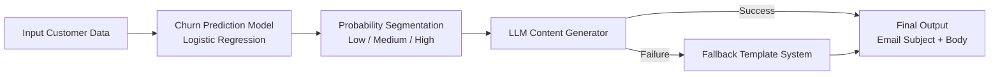

# RetentionFlow-AI

RetentionFlow-AI is an end-to-end AI workflow for e-commerce retention.
It combines a discriminative churn model with a generative content layer to produce actionable, personalized marketing output.

## What It Does

- Predicts churn probability using Logistic Regression.
- Segments customers into `low`, `medium`, and `high` risk.
- Generates structured email output (`subject` + `email_body`) via LLM.
- Falls back to safe templates when LLM output fails.
- Logs full pipeline activity to `logs/pipeline.log`.

## Architecture



## Project Structure

- `data/customers.csv`: Synthetic churn dataset.
- `models/churn_model.pkl`: Trained classification model.
- `logs/pipeline.log`: Runtime pipeline logs.
- `src/data_generation.py`: Synthetic data creation.
- `src/train_model.py`: Model training + metrics + ROC inputs.
- `src/predict.py`: Probability + segment prediction.
- `src/generate_content.py`: LLM structured generation + fallback logic.
- `src/pipeline.py`: End-to-end orchestration and logging.
- `notebook.ipynb`: Assignment notebook.

## Setup

```bash
pip install -r requirements.txt
```

## Run

Generate synthetic data:

```bash
python src/data_generation.py
```

Train and evaluate:

```bash
python src/train_model.py
```

Run single prediction:

```bash
python src/predict.py
```

Run end-to-end pipeline:

```bash
python src/pipeline.py
```

## Environment Variables

Set one provider in `.env`:

- `OPENAI_API_KEY` and optionally `OPENAI_MODEL`
- or `GROQ_API_KEY` and optionally `GROQ_MODEL` / `MODEL`

## Notes

- Classification metrics include Accuracy, Precision, Recall, F1, ROC-AUC, and confusion matrix.
- ROC curve visualization is in the notebook.
- Pipeline logs include customer input, probability, segment, LLM success/failure, and fallback usage.
